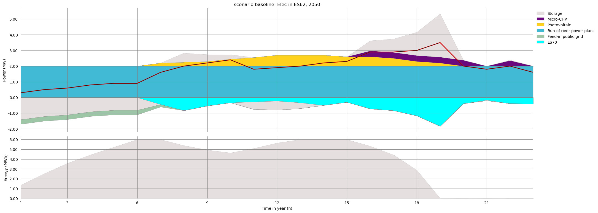
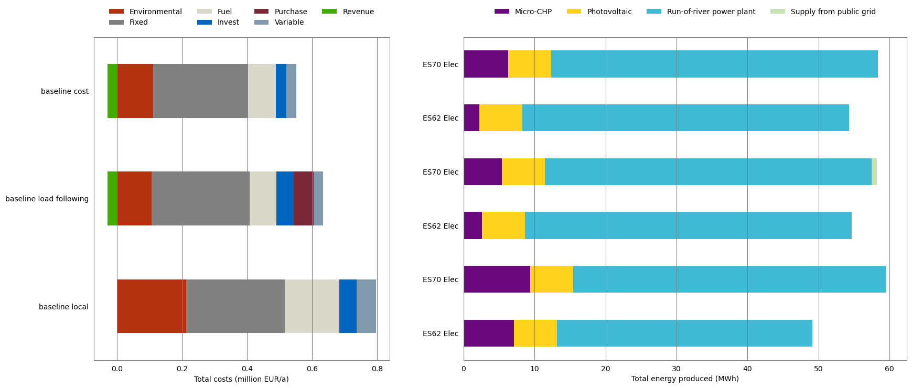
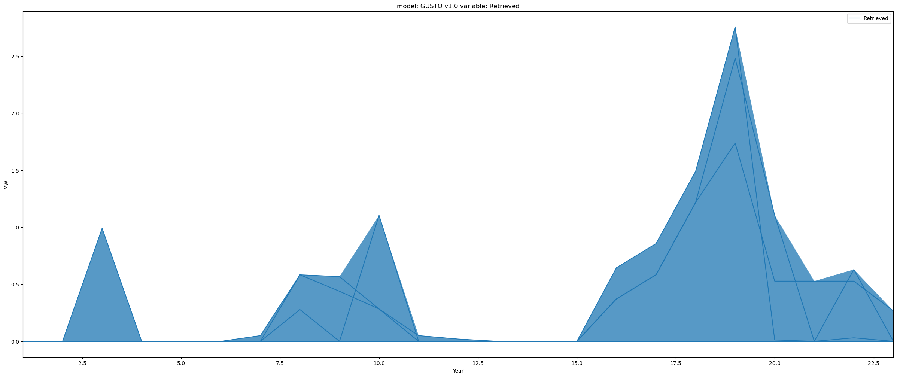

# GUSTO
enerGy commUnity SysTem mOdeling

GUSTO is a mixed-integer linear program (MILP) for energy system modeling. Thanks to the open-source energy system modeling community it is an extension of the existing open-source model (OSM) [urbs](https://github.com/tum-ens/urbs)[[1]](#1).

## Objective and scope:

The [Horizon 2020 openENTRANCE project](https://openentrance.eu) aims at developing, using and disseminating an open, transparent and integrated modelling platform for assessing low-carbon transition pathways in Europe. openENTRANCE will analyse the new challenges of the energy transition and demonstrate the ability of the project to answer a wide range of questions linked to the energy transition by carrying out case study simulations. This model (as a merger of the two models HEROS and OSCARS) is part of case study 3, which is described as follows:

**CS3: Need of flexibility – storage:** Comparison of the flexibility of pumped hydro storage with batteries for future high-variability power systems caused by a large share of variable renewables. Analyses for the Iberian Peninsula and the Nordic region. Impacts on pan-European level. Key aspects covered: variability, flexibility, decentralisation

More information about the case studies of the project can be found [here](https://openentrance.eu/2020/07/15/model-interface-common-database/).

## Further developments of the modeling framework:
- Extending investment costs by capacity-independent connection costs for network-based technologies
- Weighting of modeled time-steps (as an example to consider time step frequency)
- Different operational strategies of storage technologies
- Clustering algorithm for characteristic week representation to reduce simulation running time[[2]](#2).

## What are the objectives:
Different objective functions are possible. The default objective function is to minimize total costs of supply per year. In addition, the existing model also enables minimization of total emissions per year.
Furthermore, this modeling framework enables the following **operational strategies for storage** technologies.  
1. profit maximization by single consumers, communities, or companies
2. minimization of local excess/deficit by prosumers
3. load following by using battery storage capacities (this includes dumb or smart EV charging)

## What are the results:

The total costs of energy supply in the system concerned are calculated and can are split as follows: invest, fixed, variable, fuel, external, 
reveneue, purchase (see after running the model `./Output/scenario_name_folder/scenario_name`) in the sheet `Costs` of the excel results file. Many thanks to the visualization tool [pyam](https://github.com/IAMconsortium/pyam) that is used for the results presentation.

Also, the utilization of energy technologies are illustrated in the results file and as images (i.e. temporal utilization of photovoltaics). These results can be adjusted in the `run_model.py` script (i.e. `report_tuple` and `plot_tuple`).

  
  

 
 

## How to run the model:
At this point it is again pointed out that this model is an extension of the existing open-source model **urbs**. The corresponding  [repository](https://github.com/tum-ens/urbs) contains a very detailed documentation and instructions for installation which can be referred to. However, the following steps might be the quickest path to get first results of the model and is also pointed out in the reffered repository. Thereby, a new environment is created (more details about virtual environments [here](https://packaging.python.org/guides/installing-using-pip-and-virtual-environments/)).

1. Download and install [Miniconda](https://docs.conda.io/en/latest/miniconda.html) for your machine (keep both checkboxes *modify PATH* and *register Python* selected).
2. Download the [environment file](https://github.com/sebastianzwickl/GUSTO/blob/master/gusto-env.yml) which contains the required packages and corresponding versions (more experienced Python users know the advantages and disadvantages of this but these are not so relevant for a first step towards model results).
3. Launch a new command prompt (Windows: Win+R, type "cmd", Enter)
4. Install the requirements via Miniconda by `conda env create -f gusto-env.yml`.
5. Each time you open a new terminal (like Anaconda Prompt (miniconda3)) activate the environment by `conda activate gusto`.

Afterwards you can run the model. Therefore open a `Anaconda Propmpt (miniconda3)` terminal. Use the `cd` command to change the current directiory and open the related one where you find `run_model.py`. Finally type `python run_model.py` to solve the optimization problem. The results can be found in the `Output` folder. 

## User guide:
For the base open-source model urbs a detailed description exists [here](https://github.com/sebastianzwickl/GUSTO/blob/master/User%20guide/urbs.pdf). 

 This work is licensed under a <a rel="license" href="http://creativecommons.org/licenses/by/4.0/">Creative Commons Attribution 4.0 International License</a>.

## References
<a id="1">[1]</a> 
Dorfner, J., and T. Hamacher (2017)
"urbs: A linear optimisation model for distributed energy systems." Urbs 0.7 1"
"Scikit-learn: Machine Learning in Python." JMLR 12, pp. 2825-2830.

<a id="2">[2]</a> 
Pedregosa et al. (2011)
"Scikit-learn: Machine Learning in Python." JMLR 12, pp. 2825-2830.
