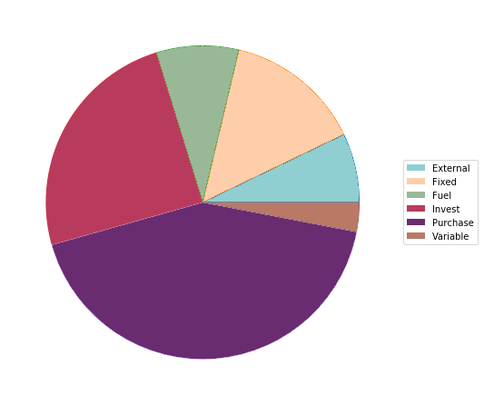

# GUSTO
enerGy commUnity SysTem mOdeling

GUSTO is a mixed-integer linear program (MILP) for energy system modeling. Thanks to the open-source energy system modeling community it is an extension of the existing open-source model (OSM) [urbs](https://github.com/tum-ens/urbs)[[1]](#1).

## Further developments of the modeling framework:
- Extending investment costs by capacity-independent connection costs for network-based technologies
- Weighting of modeled time-steps (as an example to consider time step frequency)
- Different operational strategies of storage technologies
- Clustering algorithm for characteristic week representation to reduce simulation running time[[2]](#2).

## What are the objectives:
Different objective functions are possible. The default objective function is to minimize total costs of supply per year. In addition, the existing model also enables minimization of total emissions per year.
Furthermore, this modeling framework enables the following **operational strategies for storage** technologies.  
1. profit maximization by single consumers, communities, or companies
2. minimization of local excess/deficit by prosumers
3. load following by using battery storage capacities (this includes dumb or smart EV charging)

## What are the results:

## References
<a id="1">[1]</a> 
Dorfner, J., and T. Hamacher (2017)
"urbs: A linear optimisation model for distributed energy systems." Urbs 0.7 1"
"Scikit-learn: Machine Learning in Python." JMLR 12, pp. 2825-2830.

<a id="2">[2]</a> 
Pedregosa et al. (2011)
"Scikit-learn: Machine Learning in Python." JMLR 12, pp. 2825-2830.
